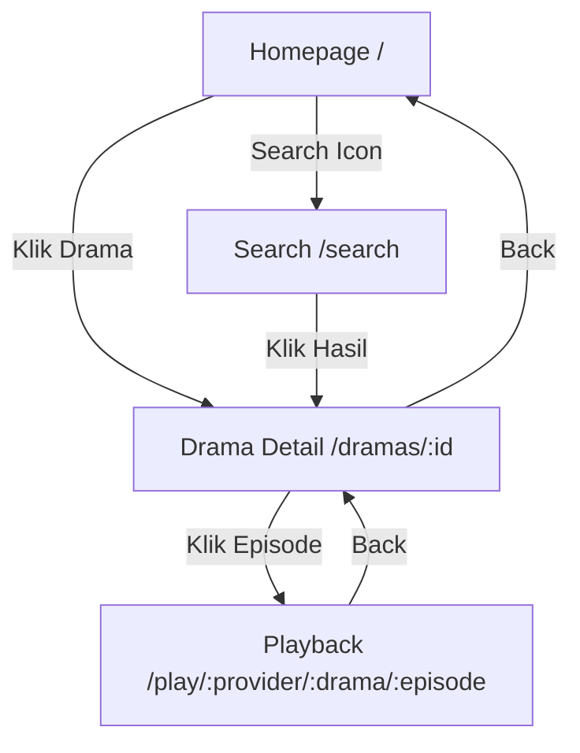

# Comprehensive UI/UX Plan: dracinhub Platform Redesign

## Executive Summary

Analisis lengkap user flow dan rencana redesign untuk platform dengan 42 provider.

---

## Current User Flow Analysis

---

## Critical Issues Found

### 1. Homepage Issues
| Issue | Impact | Priority |
|-------|--------|----------|
| Only 8 dramas displayed | Poor content discovery | HIGH |
| No provider filter | Cannot browse by provider | HIGH |
| No Continue Watching | Low user retention | HIGH |
| No genre discovery | Limited discovery | MEDIUM |
| Hero doesn't auto-rotate | Single featured drama only | MEDIUM |

### 2. Drama Detail Issues
| Issue | Impact | Priority |
|-------|--------|----------|
| Episode grid shows numbers only | Poor UX | HIGH |
| No "Continue from" banner | User must remember episode | HIGH |
| No related dramas | Low content stickiness | MEDIUM |
| Limited provider info | Weak branding | LOW |
| No share functionality | Viral growth limited | LOW |

### 3. Playback Issues
| Issue | Impact | Priority |
|-------|--------|----------|
| No episode list | Cannot switch episodes | HIGH |
| No "Next Episode" button | Poor binge experience | HIGH |
| No auto-play | Interrupted watching | MEDIUM |
| Limited video controls | Poor accessibility | MEDIUM |
| No gesture support | Mobile UX poor | LOW |

### 4. Search Issues
| Issue | Impact | Priority |
|-------|--------|----------|
| No provider filter | Generic results | HIGH |
| No genre filter | Limited discovery | MEDIUM |
| No recent searches | Repetitive typing | LOW |
| No autocomplete | Search friction | MEDIUM |

---

## Revised Implementation Plan

### Phase 1: Core Navigation & Layout
- Add Bottom Navigation (Home, Explore, Search, Profile)
- Standardize Header behavior
- Add consistent layout wrapper

### Phase 2: Homepage Redesign (High Priority)
1. Hero Banner - Auto-rotate 5 dramas
2. Provider Filter Bar - Sticky scrollable tabs
3. Continue Watching - Horizontal scroll with progress
4. Trending Section - Rank badges
5. Provider Sections - Collapsible rows
6. New Releases - Grouped by time
7. Genre Grid - Discovery categories

### Phase 3: Drama Detail Enhancement
1. Episode thumbnails with preview
2. Continue watching banner
3. Related dramas section
4. Enhanced provider card
5. Share functionality

### Phase 4: Playback Overhaul
1. Episode drawer/sidebar
2. Next episode with countdown
3. Enhanced controls (subtitle, speed)
4. Gesture support
5. Mini player mode

### Phase 5: Search Enhancement
1. Filter sidebar (provider, genre)
2. Recent searches
3. Autocomplete
4. Rich results
5. Search tabs

### Phase 6: New Pages
1. Genre Page (/genres/:slug)
2. Provider Page (/providers/:slug)
3. History Page (/history)
4. Bookmarks Page (/bookmarks)

---

## Component Architecture

### New Components Required

1. **BottomNav** - Fixed bottom navigation
2. **ProviderFilterBar** - Sticky provider tabs
3. **HeroBanner** - Auto-rotating carousel
4. **ContinueWatchingSection** - Progress tracking
5. **HorizontalDramaSection** - Reusable drama row
6. **ProviderSection** - Collapsible provider content
7. **NewReleasesSection** - Time-grouped content
8. **GenreGrid** - Category discovery
9. **EpisodeDrawer** - Slide-in episode list
10. **VideoControls** - Enhanced player controls

### API Endpoints Required

1. `GET /api/v1/home` - Enhanced with sections
2. `GET /api/v1/home/continue` - Continue watching
3. `GET /api/v1/home/trending` - Trending with timeframe
4. `GET /api/v1/home/new-releases` - New content
5. `GET /api/v1/providers` - Provider list
6. `GET /api/v1/genres` - Genre list

---

## Success Metrics

1. **Engagement**: Time on site > 5 minutes
2. **Discovery**: Provider section CTR > 10%
3. **Retention**: Continue watching completion > 40%
4. **Playback**: Episode completion rate > 60%
5. **Search**: Search-to-click rate > 25%

---

## Implementation Order

Priority based on user impact:
1. Homepage Phase 2 (highest user impact)
2. Drama Detail Phase 3 (content consumption)
3. Playback Phase 4 (core experience)
4. Search Phase 5 (discovery)
5. Navigation Phase 1 (foundation)
6. New Pages Phase 6 (expansion)
