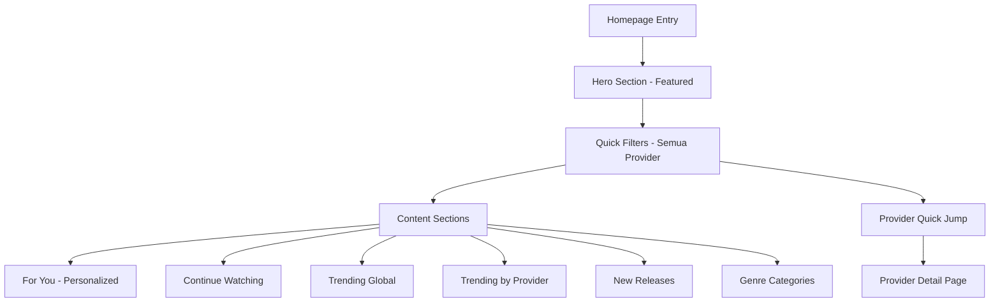

# Homepage Redesign: Scalable UI/UX for 42 Providers

## Executive Summary

Redesain homepage dracinhub untuk menangani **42 provider** dengan pengalaman pengguna yang tetap intuitif dan tidak overwhelming. Pendekatan: **layered discovery** - mulai dari konten umum, kemudian memungkinkan filtering by provider, genre, dan personalisasi.

---

## Current State Analysis

### Masalah Saat Ini
- Homepage hanya menampilkan 8 drama total (4 trending + 4 populer)
- Tidak ada cara untuk menemukan konten dari provider tertentu
- Tidak ada personalisasi atau "For You" section
- Tidak ada Continue Watching untuk user retention
- Struktur tidak scalable untuk 42 provider

### Goals Redesign
1. **Discovery**: User dapat menemukan konten dari 42 provider dengan mudah
2. **Personalization**: Konten yang direkomendasikan berdasarkan preferensi
3. **Retention**: Continue watching section untuk kembali melanjutkan
4. **Performance**: Loading cepat meski data dari banyak provider
5. **Scalability**: Arsitektur yang bisa menampung penambahan provider baru

---

## Proposed Architecture

### 1. Layered Navigation Pattern



### 2. Component Hierarchy

```
HomePage
├── HeroBanner (Featured Drama)
├── StickyFilterBar
│   ├── "All" Tab
│   ├── Top Providers (5-6 popular)
│   └── "More" Dropdown
├── ContinueWatchingSection (if logged in)
├── ForYouSection (AI/Algo recommendations)
├── TrendingGlobalSection
├── SectionByProvider (horizontal scroll)
│   ├── DramaBox Row
│   ├── ShortMax Row
│   ├── ... (collapsible)
├── NewReleasesSection
├── GenreCategoriesSection
└── Footer
```

---

## Section Details

### 1. Hero Banner (Featured Drama)
**Purpose**: Hook pengguna dengan konten premium
- Full-width poster dengan gradient overlay
- CTA: "Tonton Sekarang"
- Metadata: Rating, Episode count, Provider badge
- Auto-rotate 3-5 featured dramas setiap 5 detik

### 2. Sticky Filter Bar (Provider Navigation)
**Purpose**: Quick access ke provider favorit
```
[Semua] [DramaBox] [ShortMax] [FlexTV] [ReelShort] [GoodShort] [▼ More 36]
```
- Horizontal scrollable tabs
- "Semua" sebagai default view
- Top 5-6 provider berdasarkan popularitas
- "More" dropdown dengan search untuk provider lainnya
- Sticky position saat scroll

**Interaction**:
- Klik provider tab → filter semua section di bawah
- Active state dengan underline merah
- Badge untuk provider baru/menarik

### 3. Continue Watching Section
**Purpose**: User retention, lanjutkan nonton
- Horizontal card dengan progress bar
- Show: Thumbnail, Title, Episode number, Progress %
- Maksimal 5-6 items
- Hanya muncul jika ada watch history

### 4. For You Section (Personalized)
**Purpose**: Rekomendasi berdasarkan history & preference
- Algoritma sederhana: genre yang sering ditonton
- Mix dari berbagai provider
- "Not interested" button untuk tuning
- Refresh button untuk rekomendasi baru

### 5. Trending Global Section
**Purpose**: Konten populer saat ini
- 10-12 items horizontal scroll
- Rank badge (#1, #2, #3, etc)
- Provider badge di thumbnail
- Update setiap jam via cron

### 6. Section by Provider
**Purpose**: Showcase konten per provider
- Collapsible sections untuk menghemat space
- Max 3-4 provider yang expanded by default
- "Lihat Semua" link ke provider detail page
- Provider logo + nama di header section

```
┌─────────────────────────────────────────────────────┐
│ [Logo] DramaBox                    [Lihat Semua >]  │
├─────────────────────────────────────────────────────┤
│ [Card] [Card] [Card] [Card] [Card] ... [Card]       │
└─────────────────────────────────────────────────────┘
```

### 7. New Releases Section
**Purpose**: Konten terbaru dari semua provider
- Sort by release date
- "New" badge untuk konten < 7 hari
- Group by hari: Hari Ini, Kemarin, Minggu Ini

### 8. Genre Categories Section
**Purpose**: Discovery berdasarkan genre
- Grid kategori: Romance, Action, Comedy, Thriller, dll
- Setiap kategori menampilkan 3 poster representatif
- Tap untuk masuk ke genre page

---

## Data Architecture

### API Endpoints Needed

```typescript
// Existing
GET /api/v1/home - Get home dramas (currently only 20 by popularity)

// New endpoints needed
GET /api/v1/home?provider={slug} - Filter by provider
GET /api/v1/home?genre={genre} - Filter by genre
GET /api/v1/home/continue - Get continue watching (requires auth)
GET /api/v1/home/for-you - Get personalized recommendations (requires auth)
GET /api/v1/home/new-releases - Get new releases
GET /api/v1/home/trending - Get trending global
GET /api/v1/providers - Get provider list with stats
```

### Database Queries

```sql
-- Get dramas by provider
SELECT d.*, p.name as provider_name
FROM dramas d
JOIN providers p ON d.provider_slug = p.slug
WHERE p.status = 'active'
AND ($1 IS NULL OR d.provider_slug = $1)
ORDER BY d.popularity_score DESC
LIMIT 20;

-- Get continue watching
SELECT wh.*, d.title, d.cover_url, d.episode_count
FROM watch_history wh
JOIN dramas d ON wh.drama_id = d.id
WHERE wh.user_id = $1
AND wh.progress < 95
ORDER BY wh.updated_at DESC
LIMIT 10;

-- Get new releases
SELECT d.*, p.name as provider_name
FROM dramas d
JOIN providers p ON d.provider_slug = p.slug
WHERE d.created_at > NOW() - INTERVAL '30 days'
ORDER BY d.created_at DESC
LIMIT 20;
```

---

## UI Components Specification

### 1. ProviderFilterBar
```typescript
interface ProviderFilterBarProps {
  providers: Provider[];
  activeProvider: string | 'all';
  onProviderChange: (provider: string) => void;
  maxVisibleProviders?: number; // default: 6
}
```

### 2. DramaCard (Enhanced)
```typescript
interface DramaCardProps {
  drama: Drama;
  variant?: 'default' | 'compact' | 'featured';
  showProviderBadge?: boolean;
  showRank?: number; // untuk trending
  showProgress?: number; // untuk continue watching
  showNewBadge?: boolean;
}
```

### 3. HorizontalSection
```typescript
interface HorizontalSectionProps {
  title: string;
  subtitle?: string;
  actionLabel?: string;
  onAction?: () => void;
  children: React.ReactNode;
  collapsible?: boolean;
  defaultExpanded?: boolean;
}
```

### 4. ContinueWatchingCard
```typescript
interface ContinueWatchingCardProps {
  drama: Drama;
  episodeNumber: number;
  progressPercent: number;
  lastWatchedAt: string;
}
```

---

## Responsive Design

### Desktop (>1024px)
- Hero: Full width dengan info di samping (50/50)
- Provider tabs: Full horizontal
- Sections: 6 cards visible
- Genre grid: 4 columns

### Tablet (768px - 1024px)
- Hero: Full width, info di bawah
- Provider tabs: Scrollable
- Sections: 4 cards visible
- Genre grid: 3 columns

### Mobile (<768px)
- Hero: Vertical, aspect 3/4
- Provider tabs: Scrollable dengan snap
- Sections: 2.5 cards visible (peek next)
- Genre grid: 2 columns
- Sticky bottom nav (existing)

---

## Performance Optimizations

### 1. Lazy Loading
- Images: Next.js Image dengan lazy loading
- Sections: Load on scroll into viewport
- Provider sections: Collapse by default, expand on demand

### 2. Virtual Scrolling
- Untuk list panjang (>20 items)
- Gunakan react-window atau react-virtualized

### 3. Caching Strategy
- Redis cache untuk home data: TTL 5 menit
- Stale-while-revalidate untuk sections
- LocalStorage untuk continue watching

### 4. Pagination
- Initial load: 20 items per section
- Load more: 20 additional items on scroll

---

## State Management

```typescript
interface HomeState {
  // Filters
  activeProvider: string | 'all';
  activeGenre: string | null;
  
  // Data
  featuredDrama: Drama | null;
  continueWatching: ContinueWatchingItem[];
  forYou: Drama[];
  trending: Drama[];
  providerSections: ProviderSection[];
  newReleases: Drama[];
  
  // UI State
  expandedProviders: Set<string>;
  loadingSections: Set<string>;
}
```

---

## Implementation Phases

### Phase 1: Core Structure
1. Update DramaCard component dengan badge & progress
2. Buat ProviderFilterBar component
3. Update HeroBanner dengan auto-rotate

### Phase 2: Sections
1. Implement Continue Watching section
2. Implement For You section
3. Implement Trending Global section
4. Implement New Releases section

### Phase 3: Provider Integration
1. Implement Provider Sections (by provider rows)
2. Provider detail page
3. Provider quick jump navigation

### Phase 4: Advanced Features
1. Genre categories grid
2. Search & filter integration
3. Personalization algorithm

### Phase 5: Optimization
1. Virtual scrolling
2. Lazy loading sections
3. Performance monitoring

---

## Visual Design Tokens

### Colors (Existing)
- Background: `neutral-950` (#0a0a0a)
- Surface: `neutral-900` (#171717)
- Primary: `red-600` (#dc2626)
- Text Primary: White
- Text Secondary: `neutral-400` (#a3a3a3)
- Border: `white/5` atau `neutral-800`

### Typography
- Hero Title: text-4xl, font-black
- Section Title: text-xl, font-black
- Card Title: text-xs, font-bold
- Caption: text-[10px], text-neutral-500

### Spacing
- Section gap: mt-8
- Card gap: space-x-4
- Padding horizontal: px-4

### Effects
- Card hover: scale-105, brightness increase
- Backdrop blur: backdrop-blur-xl
- Transitions: duration-300 atau duration-500

---

## Success Metrics

1. **Engagement**: Time on site > 5 menit
2. **Discovery**: CTR ke provider sections > 10%
3. **Retention**: Continue watching completion rate > 40%
4. **Performance**: LCP < 2.5s, CLS < 0.1
5. **Scalability**: Load time tetap < 3s dengan 42 provider

---

## Appendix: Provider Display Priority

Provider diurutkan berdasarkan:
1. Popularity score (jumlah konten + views)
2. Content freshness (update frequency)
3. VIP tier (VIP1 > VIP2 > VIP3)
4. Alphabetical (untuk yang sama)

Top 6 default visible providers bisa dikonfigurasi via admin/config.
